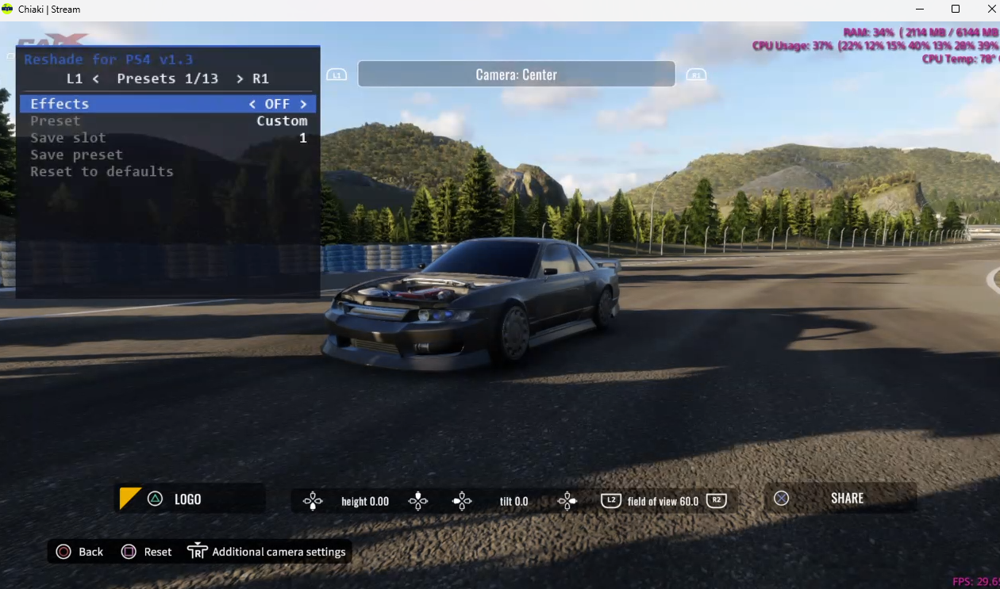
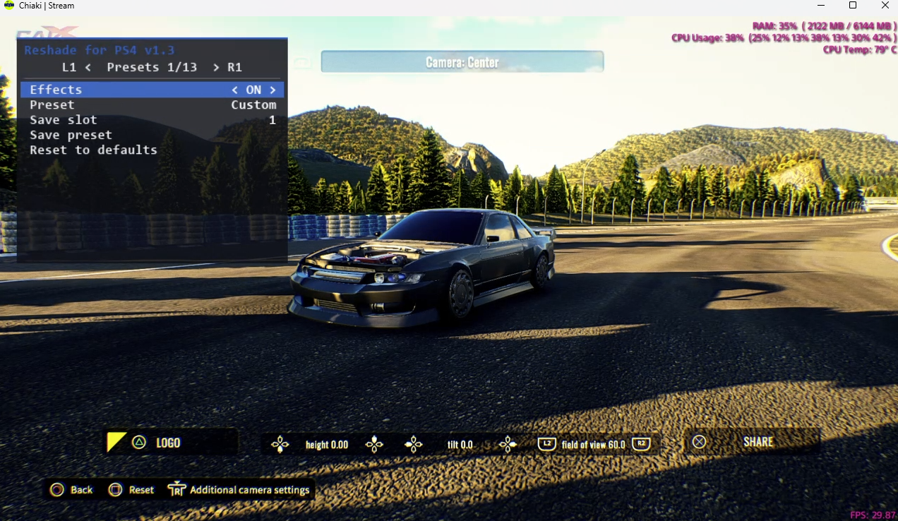
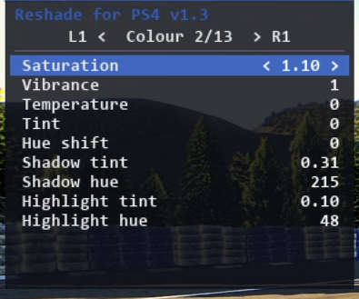
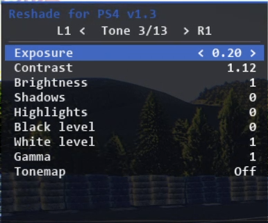
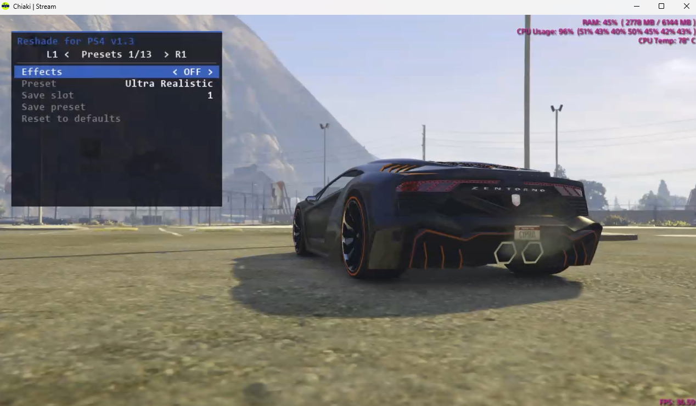
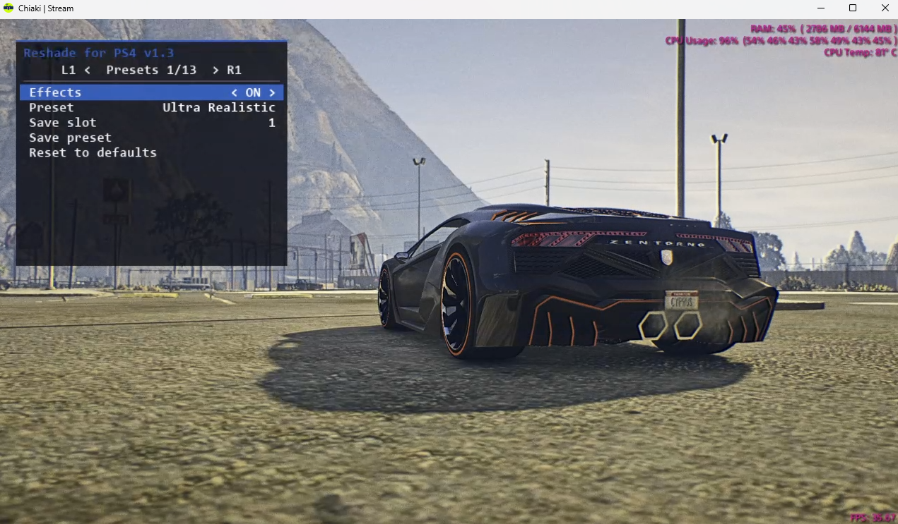

# Reshade-PS4

> ReShade post-processing effects for PS4 — powered by GoldHEN plugins.

**Original author:** toweliee (with assistance from Claude)
**Revised & published by:** MordecaiOG

---

## ✅ Tested Firmware

| Firmware |
|----------|
| 12.00 |
| 13.02 |

---

## 🎮 Known Working Titles

| Title ID | Game |
|----------|------|
| CUSA15633 | CarX |
| CUSA12398 | The Forest |
| CUSA00419 | GTA V |
| CUSA01830 | Assetto Corsa |
| CUSA00265 | Minecraft |
| CUSA16596 | Cyberpunk 2077 |

---

## 📦 Installation

1. Download **Reshade.zip** from the [latest release](https://github.com/MordecaiOG/Reshade-Ps4/releases/tag/reshade_ps4).

2. Copy files to your PS4:

   | File | Destination |
   |------|-------------|
   | `postfx.prx` | `/data/GoldHEN/Plugins/` |
   | `postfx_icon.png` | `/data/GoldHEN/` |

3. Add your Title ID(s) to `/data/GoldHEN/Plugins.ini`:

   ```ini
   [CUSA00419]
   /data/GoldHEN/plugins/postfx.prx

   [CUSA00265]
   /data/GoldHEN/plugins/postfx.prx
   ```

---

## 🎛️ Controls

| Input | Action |
|-------|--------|
| R3 + D-pad Down | Open Menu |
| R1 / L1 | Change Pages |

On first load, you'll receive an in-game notification confirming the plugin is active.

---

## 💾 Presets

Your saved presets are stored at:

```
/data/GoldHEN/PostFx/
```

Presets are portable — share them with friends or the community freely.

---

## ⚠️ Notice

If you use **third-party multiplayer plugins**, make sure `postfx.prx` is listed **after** them in your `Plugins.ini`.

---

## 📸 Screenshots







